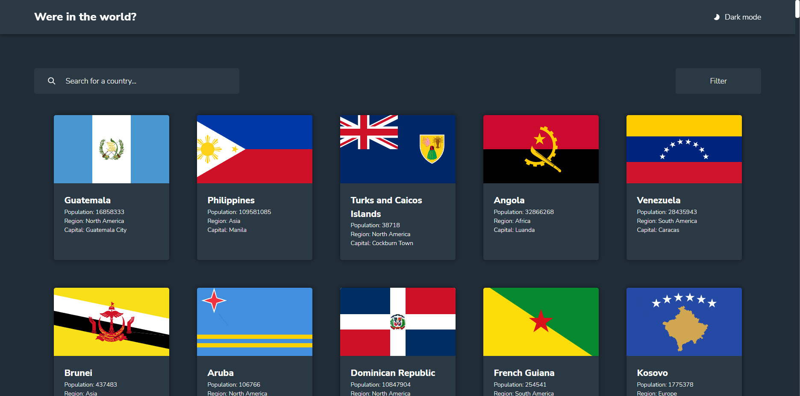

# CountriesAPI




## Libraries

- React
- Emotion
- Framer-motion
- Vite
- React Querry
- Axios

## Icons

- Fluentui/react-icons

## Running this project

1. Install all dependencies.

```sh
pnpm install
```

2. Start react development server.

```sh
pnpm dev
```
